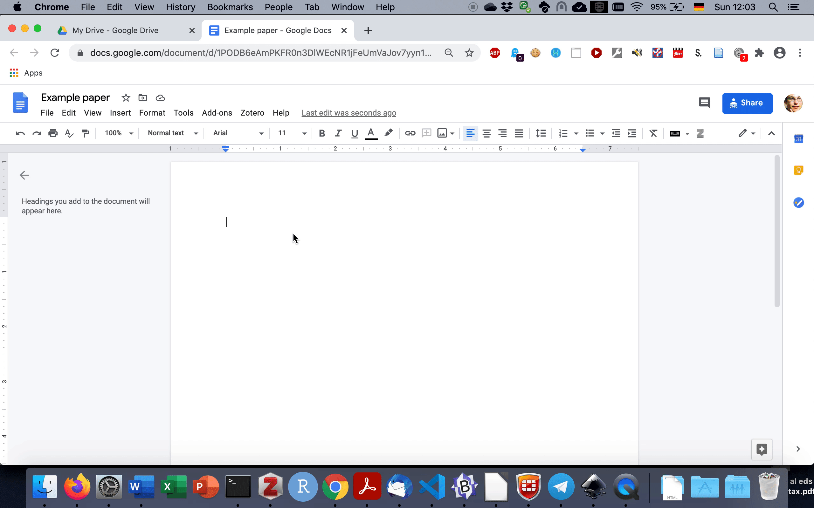
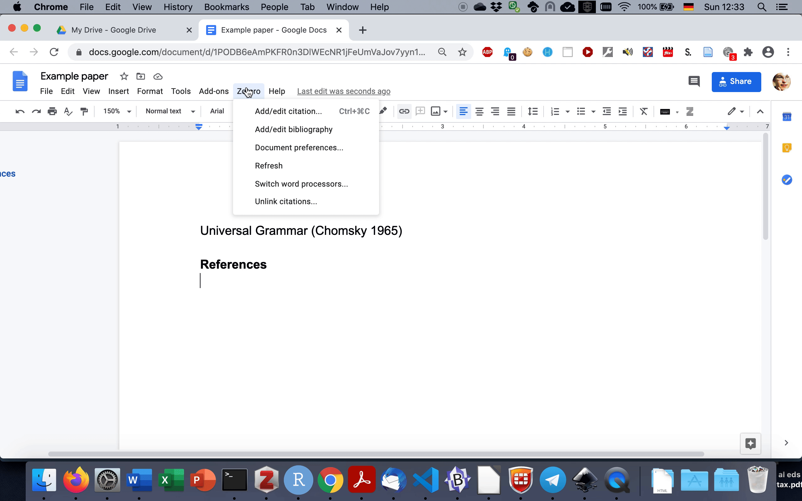

```{r setup, include=FALSE}
knitr::opts_chunk$set(echo = TRUE)
```


When collaborating with colleagues, I frequently use Googledocs for writing papers or creating presentations. Using Googledocs is easy enough, but there are some tricks and hidden features that are not entirely obvious (at least in my experience). So in this short tutorial, I would like to share a few of them. 


# Create a public link

This is probably one of the more well-known features but still worth pointing out: While you need a Google account for creating a Googledoc, you don't need one for viewing or editing one. So if you want to invite collaborators who don't have a Google account, it's easy enough to create a public link. Needless to say, you shouldn't do this when you're working on sensitive data, in which case you probably shouldn't use Googledocs in the first place. But for harmless linguistics papers like the ones I'm writing, it's good enough.

When creating a public link, keep in mind that Googledocs will create a view-only link by default. This means that your collaborators won't be able to edit the file unless you change the default setting:


```{r createlink, echo = FALSE, fig.cap="Creating a public link in a Googledoc."}

knitr::include_graphics("fig/create_link.gif")

```

# Customize the autocorrect options

Autocorrect options can be a nightmare for linguists, and whenever I have to install a new version of Office, the first thing I do is turning most of them off. (I did my PhD on morphology, and affixes look really ugly when hyphens are replaced with dashes -- cf. *‑able* vs. *–able*; most people probably won't notice the difference, but morphologists will...). 

In Googledocs, I've also turned most autocorrect options off, but I'm also trying to use them to my advantage. While you can't define custom keyboard shortcuts as you can e.g. in Word, you can define custom letter combinations that get replaced with whatever target string you define. For example, to easily type dashes, I let Googledocs replace two hyphens with a dash:  \-\- becomes –. And since I've started working on language acquisition, I'm citing Ewa Dąbrowska so often that it's become a bit tedious to add the funny diacritic manually each time, or to copy&paste the name from somewhere else -- so I just added Dabrowska > Dąbrowska to my list of custom substitutions, as shown in Fig. \@ref(fig:replacetool).

The function is hidden in Tools > Preferences > Substitutions:

```{r replacetool, echo = FALSE, fig.cap="Adding custom substitutions."}

knitr::include_graphics("fig/replacetool.gif")

```

Fig. \@ref(fig:replaceinaction) shows the substitution tool in action -- as you can see, the source string is replaced by the target string, which is highlighted. If you press the back button immediately after the substitution, it will be undone and you'll keep the source string instead. This is important in cases in which I actually want to keep the source string, e.g. the two hyphens \-\-.

```{r replaceinaction, echo = FALSE, fig.cap="Using custom substitutions."}



```


# Zotero integration

One of the most convenient features that I've only discovered recently is the possibility to integrate Zotero, an open-source, cross-platform reference manager. And after writing an entire multi-author paper using this integration, I can confirm that it works well even in collaborative situations. In this case, however, all collaborators need to have Google accounts, which can be linked up to Zotero via the Zotero Connector plugin - see [here](https://www.zotero.org/support/google_docs) for details.

If you collaborate on a document using the Zotero plugin, you should create a shared Zotero library (and make sure that you only cite works from libraries that are shared between the collaborators). As shown below, you can simply select a reference...

```{r zoterointegration, echo = FALSE, fig.cap="Creating a reference using Zotero integration."}

knitr::include_graphics("fig/zotero_integration.gif")

```

... and generate a bibliography in the end:


```{r bibliography, echo = FALSE, fig.cap="Creating a bibliography using Zotero integration."}

 


```

This turned out to be particularly helpful for papers that require citation styles that work with citation numbers rather than e.g. Author-Year -- for obvious reasons, that's almost impossible to write efficiently without a reference manager.


```{r ccbysa, echo = FALSE, fig.align = 'center', out.width = '20%', out.height = '20%'}
knitr::include_graphics("fig/by-sa.png")
```


<!--chapter:end:/Users/stefanhartmann/sciebo/Tutorials/googledocs/index.Rmd-->


<!--chapter:end:/Users/stefanhartmann/sciebo/Tutorials/googledocs/index.Rmd-->


<!--chapter:end:/Users/stefanhartmann/sciebo/Tutorials/googledocs/index.Rmd-->

